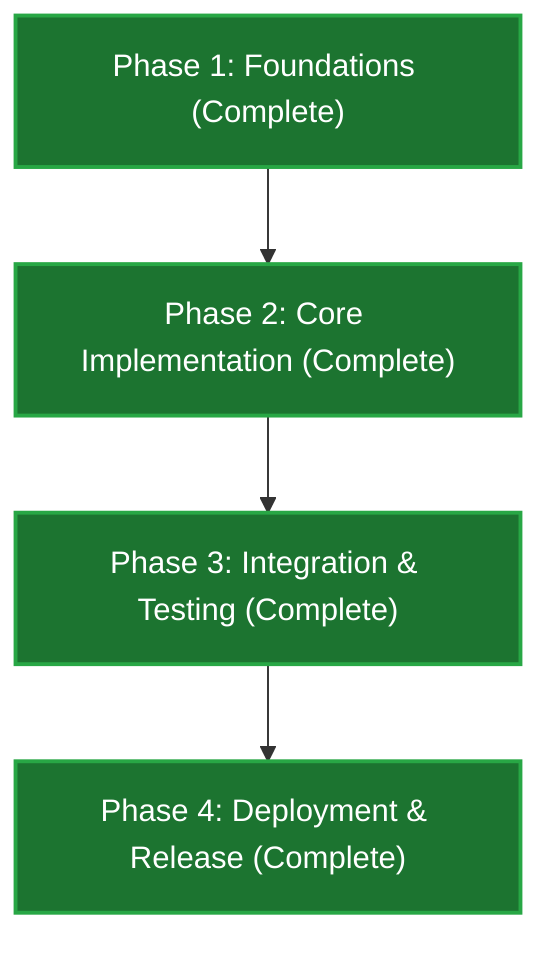

# Alpha-Zero-G - Project Roadmap

This roadmap tracks the development progress, target architecture, and phases for **Alpha-Zero-G**.

> **Agents:** read [`docs/agents/current-state.md`](docs/agents/current-state.md) first for what is built today vs this plan.

---

## Personas

| Persona | Goal | Primary surface |
|---------|------|-----------------|
| **AI Agents** | Execute tasks, consume instructions/skills, and maintain codebase alignment | Local agent environment (`agy`) |
| **Human Software Engineers** | Configure, scaffold, test, and run the `azg` tool & hooks | Command Line Interface (`azg`) |

---

## Current Project Status: **All Phases Complete (Phase 9/Production Ready)**

---

## Implementation Phases

### Phase 1: Repo Infrastructure & Foundations (Complete)

- [x] Initialize repository structure and configuration.
- [x] Setup testing and linting tools.

---

### Phase 2: Core Implementation (Complete)

- [x] Core business logic and data structures (CLI setup, new, apply, update, uninstall).
- [x] Basic unit and integration tests (test-phase0 through test-phase9).

---

### Phase 3: Integration & Testing (Complete)

- [x] Integration with external services or databases (mattpocock-skills vendoring, tool-map remapping, hook libraries).
- [x] System and end-to-end verification (test-azg.sh, verify_docs.py, and verify_lightweight_teamwork.py).

---

### Phase 4: Deployment & Release (Complete)

- [x] Build and release pipeline.
- [x] Production hosting setup and verification (machine-level install via setup script).

---

> [!NOTE]
> **Pre-commit gate:** run all test and lint commands successfully before proposing commits.
