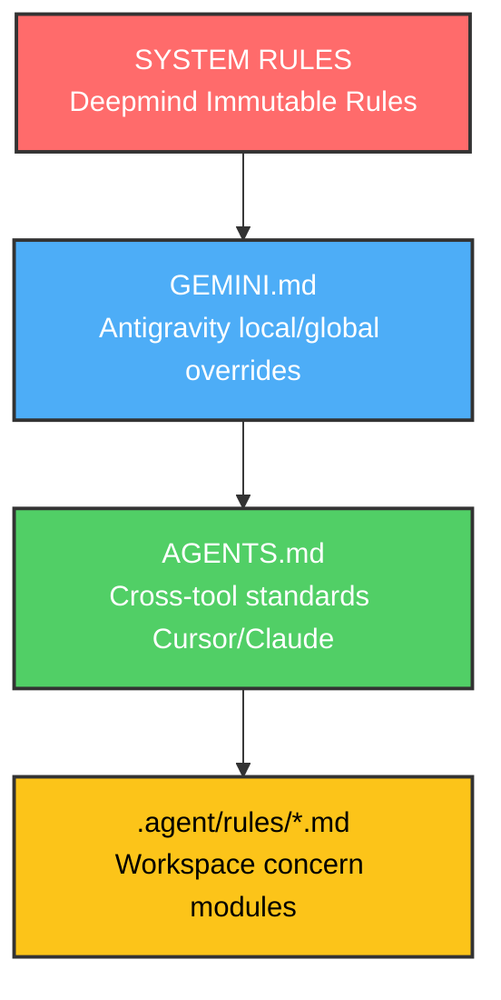

# Architecture & Layering Rules — {{PROJECT_NAME}}

This document maps out the system architecture, rule priority execution layers, and file layout guidelines of the {{PROJECT_NAME}} project.

---

## 1. Rules Architecture (Hierarchy Flow)

Antigravity merges rules from multiple levels at session initialization. The hierarchical resolution flows from highest priority (deepest system rules) to lowest (general defaults):

*Note: In the event of a conflict, files higher in the chain override those lower down.*

---

## 2. Directory Layout Rationale

The project directory structure is designed to separate **feedforward** logic, **active execution** logs, **system of record** docs, and **scaffolding**:

- **Root Configurations (`AGENTS.md`, `GEMINI.md`, `CONTEXT.md`)**: Act as high-level entry points that shape the agent's spatial awareness immediately upon session startup.
- **Session Continuity Logs (`features.json`, `progress.md`)**: State-memory tracking files that persist work history, active blockers, and completed checkpoints between isolated LLM sessions.
- **Bootstrapper (`init.sh`, `pyproject.toml`)**: Standardizes virtual environments deterministic setups across machines (local, cloud, or local/git-backed monorepo structures).
- **The Core Docs (`docs/`)**: Forms the system of record. These files represent the formal contracts, dictionaries, and architectural guidelines that outlive transient codebases.
- **Enforcement Layer (`.agents/hooks.json`)**: Deterministic safety hooks that restrict high-risk operations at the harness layer.

---

## 3. Directory Mappings

| Directory | Scope / Purpose |
|---|---|
| `/docs` | Systems guidelines, glossary definitions, model logs, and active specs |
| `/docs/adr` | Domain architectural decision records (project-specific decisions only) |
| `/docs/design` | Detailed software and math designs |
| `/src` | Core implementation code (modules, analysis classes, solvers) |
| `/notebooks` | Jupyter notebooks, scratch calculations, and py:percent sources |
| `/tests` | Unit tests, statistical assert scripts, regression suites |
| `/.agents` | Local skills and hooks configuration |
